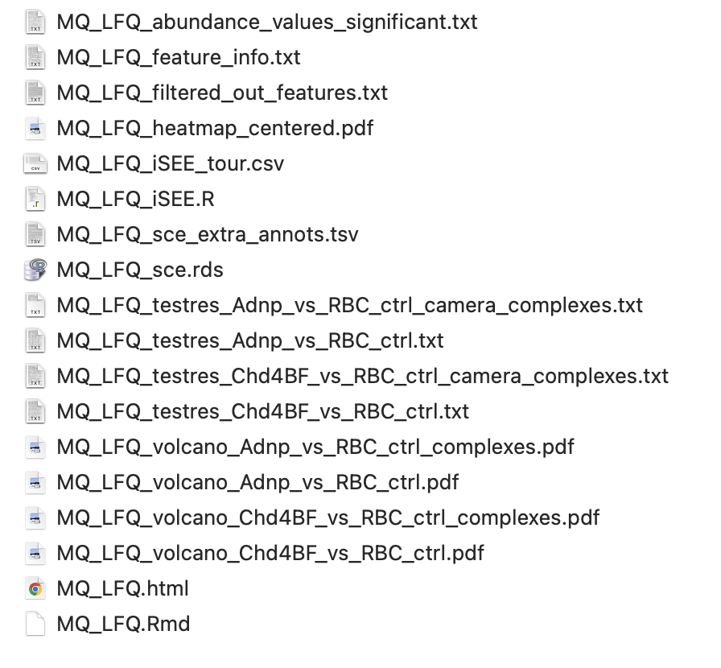

```{r, include = FALSE}
knitr::opts_chunk$set(
  collapse = TRUE,
  comment = "#>"
)
```

```{r setup, message = FALSE}
library(S4Vectors)
library(SummarizedExperiment)
library(einprot)
```

## Introduction

The `einprot` R package provides easy-to-use end-to-end proteomics workflows 
for data quantified with either `MaxQuant` [@Cox2008maxquant] (LFQ) or 
`Proteome Discoverer` [@Orsburn2021pd] (TMT). It was 
originally developed to support the proteomics platform at the FMI. The 
package can be installed from GitHub as follows: 

```{r, eval = FALSE}
install.packages("remotes")
remotes::install_github("fmicompbio/einprot")
```

## Running a full workflow

The main functions for running an end-to-end workflow are (depending on the 
experiment type and quantification engine)

* `runMaxQuantAnalysis()`
* `runPDTMTAnalysis()`

Each of these functions takes a set of arguments defining input files as well 
as analysis parameters, injects these into an R markdown template, and 
renders the resulting .Rmd file into an html report. In the process, a 
collection of output files are generated, including lists and plots of 
differentially abundant proteins, and a final `SingleCellExperiment` object 
for further exploration and analysis. 

For example, we will illustrate how to run the `MaxQuant` workflow using the 
example data provided in `einprot` (from @Ostapcuk2018chd4). The workflow 
requires a `MaxQuant` `proteinGroups.txt` file as well as (optionally) the XML 
parameter file. The type of intensities to 
use for the analysis is specified via the `iColPattern` argument.
The following code runs the workflow, using mostly default parameter values: 

```{r, eval = FALSE}
(sampleAnnot <- read.delim(system.file("extdata", "mq_example", "1356_sampleAnnot.txt",
                                       package = "einprot")))
out <- runMaxQuantAnalysis(
    outputDir = tempdir(), 
    outputBaseName = "MQ_LFQ",
    reportTitle = "MaxQuant LFQ data processing", 
    reportAuthor = "Charlotte Soneson",
    species = "mouse",
    mqFile = system.file("extdata", "mq_example", "1356_proteinGroups.txt",
                         package = "einprot"),
    mqParameterFile = system.file("extdata", "mq_example", "1356_mqpar.xml",
                                  package = "einprot"),
    iColPattern = "^LFQ\\.intensity\\.", 
    sampleAnnot = sampleAnnot,
    imputeMethod = "MinProb",
    ctrlGroup = "RBC_ctrl", 
    allPairwiseComparisons = FALSE, 
    normMethod = "none", 
    stattest = "limma", 
    includeFeatureCollections = "complexes"
)
```

This will generate a collection of output files in the designated 
output directory (here, a temporary directory). All files will be named with 
the prefix specified by `outputBaseName`. 

## Output files generated by the workflows

Running the `einprot` workflows will generate the following set of output 
files in the designated output directory: 



* A self-contained .Rmd file (here, `MQ_LFQ.Rmd`) with all the code run in the 
workflow. In principle, this can be edited and rerun manually. Note, however, 
that if the workflow function is rerun, the file will be overwritten (if 
`forceOverwrite` argument is set to `TRUE`). 
* An html report (`MQ_LFQ.html`) obtained by rendering the .Rmd file.
* A `SingleCellExperiment` object serialized to an .rds file (`MQ_LFQ_sce.rds`). 
This object reflects all the analysis steps of the workflow, and is exported 
at the end of rendering the .Rmd file. Very long annotation columns are stored
in a separate file (`MQ_LFQ_sce_extra_annots.tsv`). 
* Result files from the differential expression analysis, both for individual 
proteins and for feature sets (if applicable) (`MQ_LFQ_testres_*.txt`), and 
exported abundance values for all significant features 
(`MQ_LFQ_abundance_values_significant.txt`). 
* pdf files with volcano plots for differential expression analysis 
(`MQ_LFQ_volcano_*.pdf`), and a heatmap of the overall abundance matrix 
(`MQ_LFQ_heatmap_centered.pdf`, only for the `MaxQuant` workflow).
* An R script that, when sourced, will launch an adapted `iSEE` 
[@Rue-Albrecht2018isee] session for interactive exploration of the data 
(`MQ_LFQ_iSEE.R`, which incorporates an interactive guided tour specified in 
`MQ_LFQ_iSEE_tour.csv`). 
* Additional information about retained and filtered-out features 
(`MQ_LFQ_feature_info.txt`, `MQ_LFQ_filtered_out_features.txt`).

All file names start with the `outputBaseName` specified in the call to 
`runMaxQuantAnalysis` (here, `MQ_LFQ`).

## Listing supported species

The list of species currently supported by `einprot` can be obtained using the 
function `getSupportedSpecies()`. The species information is used to retrieve 
suitable feature identifiers for complexes and GO terms (if requested), and 
to provide automatic links to species-specific databases such as PomBase 
and WormBase, whenever applicable. 

```{r}
getSupportedSpecies()
```

## Listing available complex DBs

If specified by the user, `einprot` will test for differential abundance not 
only of individual proteins, but also of feature sets. Currently, GO terms 
and protein complexes (plus any user-specified sets) are supported. The 
built-in complex database was created using the `makeComplexDB()` function, 
and combines annotated complexes for multiple different species. Regardless 
of where it was originally defined, each complex is also lifted over to the 
current species of interest, using the ortholog conversion functionality of 
the `babelgene` package. To list the available complex databases provided 
by `einprot`, we can use the `listComplexDBs()` function: 

```{r}
## List available complex databases
(lcdb <- listComplexDBs())

## Read the most recent one
cdb <- readRDS(lcdb$complexDbPath[1])

## cdb is a list of databases - each one containing identifiers for a 
## specific species
class(cdb)
names(cdb)

cdb$mouse

## Additional information about the complexes
mcols(cdb$mouse)
```

## Checking the intensity column pattern

To check which columns will be extracted from the input text file to generate
the main intensity matrix, we can use the `getIntensityColumns()` function, 
provided with the path to the input text file and the desired `iColPattern`.

```{r}
mqFile <- system.file("extdata", "mq_example", "1356_proteinGroups.txt",
                      package = "einprot")
```

```{r}
getIntensityColumns(inFile = mqFile, iColPattern = "^LFQ\\.intensity\\.")
```

## Reading data into a `SingleCellExperiment` object

`einprot` has functionality for reading data from `MaxQuant` and 
`ProteomeDiscoverer` protein quantification text files and generating a 
`SingleCellExperiment` object. All columns in the text file that are 
typically sample-specific will be converted into assays, while all other 
columns will be added as row annotations. 

```{r}
imp <- importExperiment(mqFile, iColPattern = "^LFQ\\.intensity\\.")

## The aName output provides the name of the "main" assay 
## (corresponding to the specified iColPattern)
imp$aName

## Imported SingleCellExperiment object
imp$sce

## All assays
assayNames(imp$sce)

## Row annotation
rowData(imp$sce)
```

## Incorporating information about the experiment

In many cases it can be helpful to include additional metadata (that may not
be stored in the output files from the quantification tools) about the 
experiment in the analysis report. This can be accommodated by specifying the 
`experimentInfo` argument to `runMaxQuantAnalysis()` or `runPDTMTAnalysis()`. 
This argument should be a named list, and all entries should be scalar values. 
In the report, the list will be converted to a table and displayed. 

```{r}
experimentInfo <- list(
    `Experiment ID` = "exp1",
    Description = "A description of the experiment"
)
```

## Defining custom IDs and labels

`einprot` supports the definition of customized feature IDs and labels, to 
accommodate different run modes of the quantification tools and user 
perspectives. The identifiers are defined by the following five arguments to 
`runMaxQuantAnalysis()`/`runPDTMTAnalysis()`: 

* `idCol` - defines the feature identifiers. These must be unique. 
* `labelCol` - defines the labels that will be used in most plots (except 
where values are grouped by feature identifier, in which case the `idCol` will 
be used instead to guarantee that different features are not mixed).
* `geneidCol` - defines the gene symbol. This identifier will be used to match 
features against pre-specified GO terms and complexes, if requested. If no 
gene IDs are available, it can be set to `NULL`. 
* `proteinIdCol` - defines the protein identifiers. This will be used to 
auto-generate links to UniProt and AlphaFold pages. It should correspond to 
one or more UniProt identifiers, separated by semi-colons.
* `stringIdCol` - defines the identifier that will be matched against STRING. 
Any identifiers supported by STRING are allowed. It can also be set to `NULL` 
if no STRING matching is required. 

Each of these arguments can be either: 

* a vector of annotation column names from the input data file (after 
application of `make.names`). In this case, the values in the provided columns 
will be concatenated to create the final values for the corresponding feature
identifiers. 
* a function with a single argument (a `data.frame`, corresponding to the 
annotation columns of the input data file), returning a character vector of 
identifiers. 

We illustrate how this works with a few examples. First, we read the 
MaxQuant example data into a SummarizedExperiment object, as this corresponds 
to how the data will be represented inside the `einprot` workflows: 

```{r}
imp <- importExperiment(mqFile, iColPattern = "^LFQ\\.intensity\\.")
sce <- imp$sce
```

The available annotation columns are stored in the `rowData` of the 
SummarizedExperiment object: 

```{r}
colnames(rowData(sce))
```

Let's first define the `labelCol` (just as an example, the procedure is 
identical for the other four arguments) as a vector of column names: 

```{r}
labelCol <- c("Gene.names", "Majority.protein.IDs")
```

To see the effect this will have inside the `einprot` workflows, we call the 
`fixFeatureIds()` function and ask it to generate a new column in `rowData(sce)`, 
called `einprotLabel` and defined by the `labelCol` above. We see that the 
new column contains the values of the `Gene.names` and `Majority.protein.IDs` 
columns, concatenated.

```{r}
sce <- fixFeatureIds(sce, colDefs = list(einprotLabel = labelCol))
head(rowData(sce)$Gene.names)
head(rowData(sce)$Majority.protein.IDs)
head(rowData(sce)$einprotLabel)
```

Next, let's instead define the label as the first value in the `Gene.names` 
column (before the first semicolon). `einprot` provides a helper function for 
this: 

```{r}
labelCol <- function(df) getFirstId(df, colName = "Gene.names", separator = ";")
sce <- fixFeatureIds(sce, colDefs = list(einprotLabel = labelCol))
head(rowData(sce)$einprotLabel)
```

`einprot` also provides a helper function for combining multiple columns, 
possibly after splitting each of them by a given separator and extracting the 
first value in each. We illustrate this by defining the label as a combination 
of the gene name and the majority protein ID, but only considering the first 
ID of each type: 

```{r}
labelCol <- function(df) combineIds(
    df, combineCols = c("Gene.names", "Majority.protein.IDs"), 
    combineWhen = "always", splitSeparator = ";", 
    joinSeparator = ".", makeUnique = FALSE)
sce <- fixFeatureIds(sce, colDefs = list(einprotLabel = labelCol))
head(rowData(sce)$einprotLabel)
```

In the example above, the two columns were always combined. We can also choose
to only concatenate them when the first entry is not unique, or when the 
first entry is missing (see the `combineWhen` argument). We can also decide 
to require the returned values to be unique (by setting `makeUnique` to `TRUE`).

```{r}
labelCol <- function(df) combineIds(
    df, combineCols = c("Gene.names", "Majority.protein.IDs"), 
    combineWhen = "nonunique", splitSeparator = ";", 
    joinSeparator = ".", makeUnique = FALSE)
sce <- fixFeatureIds(sce, colDefs = list(einprotLabel = labelCol))
## For most features, the gene name is unique
head(rowData(sce)$einprotLabel)
## For some features, the protein IDs were added to the gene names to create 
## unique feature IDs
rowData(sce)$einprotLabel[head(grep("\\.", rowData(sce)$einprotLabel))]
```

Finally, we define a custom function that splits the `Fasta.headers` column
and extracts the description of the protein as the part between the first 
space and the first appearance of the `OS=` pattern. 

```{r}
## The column with fasta headers
head(rowData(sce)$Fasta.headers)
labelCol <- function(df) sub("[^ ]* (.*?) OS=.*", "\\1", df$Fasta.headers)
sce <- fixFeatureIds(sce, colDefs = list(einprotLabel = labelCol))
head(rowData(sce)$einprotLabel)
```


## Supported column patterns

The column pattern (provided to the `einprot` workflows via the `iColPattern`
argument) defines which columns of the quantification file that will be used 
to generate the main assay in the returned `SingleCellExperiment` object. 
Typically, for MaxQuant output this would be either `"^Intensity\\."`, 
`"^LFQ\\.intensity\\."` or `"^iBAQ\\."`. It is also accepted to not 
escape the periods at all. For ProteomeDiscoverer, the `iColPattern` is typically 
either `"^Abundance\\.F.+\\.Sample\\."`, `"^Abundances\\.Grouped\\."`
or `"^Abundance\\.F[0-9]+\\."`. As mentioned above, it is often helpful 
to first read the raw file into a `SingleCellExperiment` object before 
launching the entire workflow, to make sure that the column pattern is 
correctly interpreted. 

```{r}
imp <- importExperiment(mqFile, iColPattern = "^LFQ.intensity.")
```

```{r, error = TRUE}
imp <- importExperiment(mqFile, iColPattern = "unknown_pattern")
```

## The sample annotation table

A sample annotation table must be provided when running each of the `einprot` 
workflows. This `data.frame` must have at least two columns, named `sample` and
`group`, but any additional columns are also supported and will be included 
in the final `SingleCellExperiment` object. The values in the `sample` column 
must correspond to the column names of the imported `SingleCellExperiment` 
object, which are generated by removing the specified column pattern from 
the raw file column names. For example, in the data we imported in the 
previous section, we have the following sample names: 

```{r}
colnames(imp$sce)
```


## Combining groups for statistical testing

By default, `einprot` will perform all pairwise comparisons between the 
groups in the `group` column in the sample annotation table (at least one of 
the groups in each comparison must have at least two samples). In some cases, 
it is useful to specify the comparisons explicitly. For example: 

* We want to perform all pairwise comparisons, but we want to make sure that a 
specific group is always interpreted as the 'control group' (the denominator 
in the comparison) whenever it is involved in a comparison. This can be achieved
by setting `allPairwiseComparisons` to `TRUE`, and `ctrlGroup` to the 
desired control group. 
* We only want to perform a subset of all possible pairwise comparisons. In this 
case, we would directly specify `comparisons` to be a list of character 
vector of length 2, each defining a desired comparison (with the control level 
as the first element). In the example data set above, we can define e.g. 
```{r}
comparisons <- list(c("RBC_ctrl", "Adnp"), c("RBC_ctrl", "Chd4BF"))
```
* We want to combine multiple groups into one and consider all the corresponding 
samples as replicates for some comparisons. This can be achieved by defining 
the merged group in the `mergeGroup` argument. The new group can then be used 
in the defined comparisons: 
```{r}
mergeGroup <- list(newGroup = c("Adnp", "Chd4BF"))
comparisons <- list(c("RBC_ctrl", "newGroup"))
```
* We want to compare a group against its complement (all samples not in the 
group). This can be achieved by including 'complement' in the definition of 
the comparison:
```{r}
comparisons <- list(c("complement", "Adnp"))
```
This will compare the `Adnp` group to all samples not in the group. 

It is also worth noting that if the `singleFit` argument is set to `TRUE`, 
the interpretation of the comparisons involving merged groups (and complements)
changes somewhat. In this case, instead of considering all samples in the 
merged group as replicates, a model is first fit with all the original groups, 
and a contrast is designed to compare the averages of the fitted values across
the merged groups in the comparison. 

## Batch adjustment

`einprot` will adjust for batch effects by including an extra term in the 
linear model (if the chosen statistical test is either `limma` or `proDA`), 
if the sample annotation table contains a column named `batch`. In this case, 
it will also calculate a matrix of batch corrected abundance values, and use 
this for visualization. 

## Valid values for `linkTableColumns` and `interactiveDisplayColumns`

The report generated by `einprot` contains several interactive elements. If 
`addInteractiveVolcanos` is set to `TRUE`, interactive volcano plots will be 
generated for each comparison. In addition, a link table provides an overview 
of all the features in the data set. The user can define additional columns 
to include in this table, as well as columns to be displayed when hovering over 
the points in the interactive volcano plots. Any column name (or regular 
expression matching multiple column names) in the `rowData` of the exported 
`SingleCellExperiment` object can be displayed in the link table - to see what 
this entails for a specific data set/quantification setup the easiest may be 
to run through the workflow once, read the resulting `SingleCellExperiment` and 
extract the column names of the row data. For the interactive volcano plots, 
any column in the statistical test result can be included, as well as any 
'annotation' column in the row data of the `SingleCellExperiment` object (i.e., 
not the columns corresponding to the test results that are copied into the 
row data of the returned object). The separate test results are included in the
final `SingleCellExperiment` object and can be accessed via 
```{r, eval=FALSE}
testres <- metadata(sce)$testres$tests
```
(assuming that `sce` corresponds to the `SingleCellExperiment` object 
returned by the `einprot` workflows). 

## Querying the `MaxQuant`/`Proteome Discoverer` metadata

In addition to reading the protein quantifications, `einprot` also reads the 
metadata XML files generated by `MaxQuant` and `Proteome Discoverer` and 
extracts information to display in the final report. We can also convert it 
to a nice-looking table. The `Proteome Discoverer` summary function 
requires the path to a folder that contains at least the `_InputFiles.txt` 
and `_StudyInformation.txt` output files from the `Proteome Discoverer` run, 
in addition to the `.pdAnalysis` file with the run metadata (if one or more 
of the files are missing, only the information from the available file(s) is 
returned). 

```{r}
## MaxQuant
mqinfo <- readMaxQuantXML(
    system.file("extdata", "mq_example", "1356_mqpar.xml", package = "einprot"))
makeTableFromList(mqinfo)
```

```{r}
## Proteome Discoverer
pdinfo <- readProteomeDiscovererInfo(
    pdOutputFolder = system.file("extdata", "pdtmt_example", 
                                 package = "einprot"),
    pdResultName = "Fig2_m23139_RTS_QC_varMods", 
    pdAnalysisFile = system.file("extdata", "pdtmt_example", 
                                 "Fig2_m23139_RTS_QC_varMods.pdAnalysis",
                                 package = "einprot"))
makeTableFromList(pdinfo)
```

## Session info

<details>
<summary><b>
Click to expand
</b></summary>
```{r session-info, echo=FALSE}
sessionInfo()
```
</details>

## References
